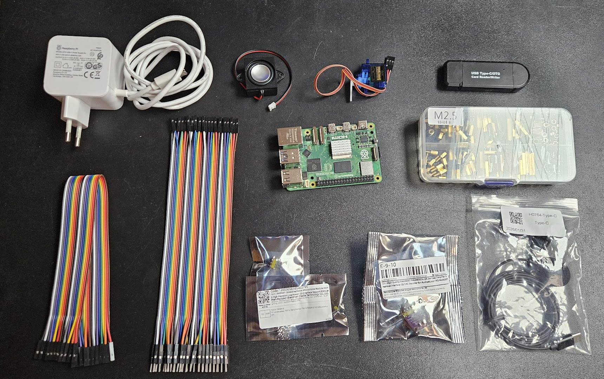
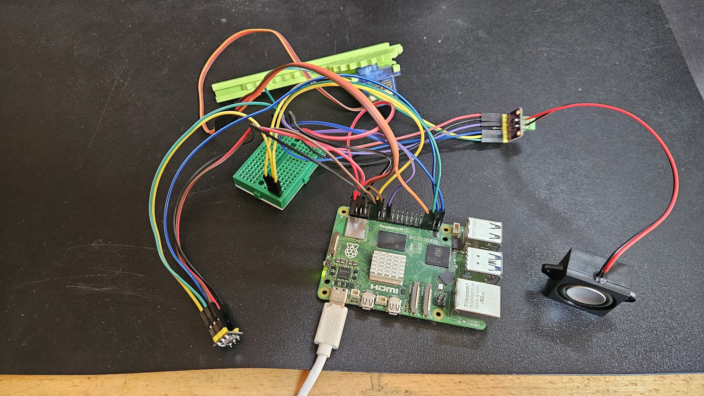

# À que coucou !

> Une boîte à coucou qui détecte l'expression **"ah que coucou"** grâce à un modèle de wake word, actionne un servomoteur pour faire sortir un œuf, et joue le son "coucou !".

Inspirée du running gag des [Guignols de l'info](https://www.youtube.com/watch?v=vwc_aIZz_1g) où Johnny Hallyday présentait une boîte mystérieuse à PPDA.

## Principe

1. Un microphone écoute en permanence l'environnement sonore
2. Quand la phrase **"ah que coucou"** est détectée, la boîte se déclenche
3. Un œuf monte mécaniquement hors de la boîte via un pignon-crémaillère
4. Le son *"coucou !"* est joué via un haut-parleur
5. L'œuf redescend après quelques secondes

Le tout fonctionne de manière autonome sur un Raspberry Pi, sans connexion internet, avec une latence inférieure à 500ms.

## Matériel

| Composant | Usage |
|-----------|-------|
| Raspberry Pi 5 | Plateforme principale |
| Servo TowerPro SG90 (GPIO13 PWM) | Actionne l'œuf |
| Micro INMP441 I2S | Capture audio |
| Ampli MAX98357A I2S | Sortie audio |
| Haut-parleur 4Ω 3W | Diffusion sonore |
| Boîte + œuf imprimés en 3D | Habillage et mécanisme |
| Breadboard 170pts | Partage bus I2S |
| Câbles Dupont F-F et M-F | Câblage |



Coût total du projet : **30-40 €** (hors RPi 5 & imprimante 3D).

## Architecture

```
aquecoucou.py           # Orchestrateur : détection -> servo -> son
wakeword.py             # Module de détection openWakeWord
├── setup.sh            # Installation complète RPi (apt, pip, config.txt, systemd)
├── deploy.sh           # Déploiement vers le RPi (tar + ssh)
└── deploy/
    └── aquecoucou.service  # Unité systemd (démarrage automatique)

tests/                  # Scripts de diagnostic
├── test_servo.py       # Test servo SG90
├── test_audio.py       # Test lecture WAV
├── test_wakeword.py    # Test détection en temps réel (affichage scores)
└── test_mic.py         # Diagnostic micro (analyse RMS, static noise)

wakeword/               # Pipeline d'entraînement
├── train_wakeword.py   # Entraînement modèle openWakeWord
├── generate_tts.py     # Génération voix synthétiques (Coqui TTS)
├── Containerfile       # Container TTS
├── Containerfile.train # Container entraînement
└── output/             # Modèle ONNX entraîné

cad/                    # CAO (OpenSCAD)
├── base.scad / .stl    # Base de la boîte
├── box.scad / .stl     # Murs de la boîte
├── pinion.scad / .stl  # Pignon 40mm (axe SG90)
├── rack.scad / .stl    # Crémaillère 110mm
├── egg.scad / .stl     # Œuf
├── rail_bracket.scad / .stl  # Rail + support servo
└── aquecoucou.3mf      # Projet d'assemblage pour mon imprimante Bambu Labs

sounds/
└── boite_a_coucou.wav  # Son "coucou !" (à fournir, voir sounds/README.md)

images/                 # Photos et captures d'écran
```

## Câblage

Tout se branche sur le header GPIO 40 broches du Raspberry Pi 5. Les composants audio (micro + ampli) partagent le même bus I2S ; le servo est piloté en PWM matériel sur GPIO13.

**Servo SG90**

| Fil servo | Broche RPi |
|---|---|
| VCC | 5V (broche 2) |
| GND | GND (broche 14) |
| Signal | GPIO13 / PWM (broche 33) |

**Micro INMP441 (I2S, entrée audio)**

| Broche INMP441 | Broche RPi |
|---|---|
| VDD | 3.3V (broche 1) |
| GND | GND (broche 9) |
| SCK (BCLK) | GPIO18 (broche 12), via breadboard |
| WS (LRCLK) | GPIO19 (broche 35), via breadboard |
| SD (DOUT) | GPIO20 (broche 38) |

Si votre module INMP441 a une broche `L/R`, reliez-la à GND (canal gauche).

**Ampli MAX98357A (I2S, sortie audio)**

| Broche MAX98357A | Broche RPi |
|---|---|
| Vin | 5V (broche 4) |
| GND | GND (broche 6) |
| BCLK | GPIO18 (broche 12), via breadboard |
| LRC | GPIO19 (broche 35), via breadboard |
| DIN | GPIO21 (broche 40) |
| SD | 3.3V (broche 17), pour activer la sortie |
| Speaker + / - | Haut-parleur 4Ω 3W |

**Le point important** : les deux horloges I2S, BCLK (GPIO18) et LRCLK (GPIO19), doivent être reliées **à la fois** au micro et à l'ampli. Un câble Dupont ne se dédoublant pas, on passe par la breadboard pour répartir chacune de ces deux lignes vers les deux composants.

Les overlays nécessaires (`googlevoicehat-soundcard` pour l'I2S et `pwm-2chan` pour le servo) sont ajoutés dans `/boot/firmware/config.txt` par `setup.sh`.



## Installation

```bash
# Sur le Raspberry Pi, tout-en-un
./setup.sh
```

`setup.sh` installe les dépendances système, crée le venv, installe les paquets Python, configure `/boot/firmware/config.txt` (désactive l'audio BCM, ajoute les overlays I2S et PWM), et installe le service systemd.

## Utilisation

```bash
python aquecoucou.py [--device 0] [--threshold 0.3] [--cooldown 5] [--model chemin]
```

Le service systemd démarre automatiquement au boot. Déployer une nouvelle version :

```bash
./deploy.sh pi@raspberrypi.local
```

## Entraînement du modèle

Le modèle de wake word "ah que coucou" est entraîné à partir de voix synthétiques générées par Coqui TTS (XTTS v2), avec augmentation audio et exemples négatifs.

```bash
# Génération des voix TTS (nécessite GPU)
cd wakeword
podman build -f Containerfile -t aquecoucou-tts .
podman run --rm --device nvidia.com/gpu=all \
  -v ./output:/app/output:z aquecoucou-tts

# Entraînement du modèle (GPU recommandé)
podman build -f Containerfile.train -t aquecoucou-train .
podman run --rm --device nvidia.com/gpu=all \
  -v ./output:/app/output:z aquecoucou-train
```

> **Note** : la génération TTS a besoin de voix de référence (fichiers WAV montés dans le conteneur via `generate_tts.py --references-dir`). Celles utilisées ici sont des voix personnelles, non distribuées avec le projet : pour régénérer les données, fournissez les vôtres. Le modèle pré-entraîné (`wakeword/output/ah_que_coucou.onnx`) est de toute façon inclus et prêt à l'emploi.

## Au-delà du code

Ce projet est né d'une idée transgénérationnelle père-fils. Le père, électronicien, devait s'occuper de la partie mécanique ; le fils (moi) de la partie logicielle. Un premier prototype fonctionnel a vu le jour en 2021 avec Snowboy, avant qu'un deuil dans la famille ne mette le projet en pause. Cinq ans plus tard, en 2026, le projet a été relancé avec les technologies actuelles : openWakeWord pour la détection, un RPi 5 comme cerveau, et une mécanique imprimée en 3D.

## Licence

MPL 2.0
